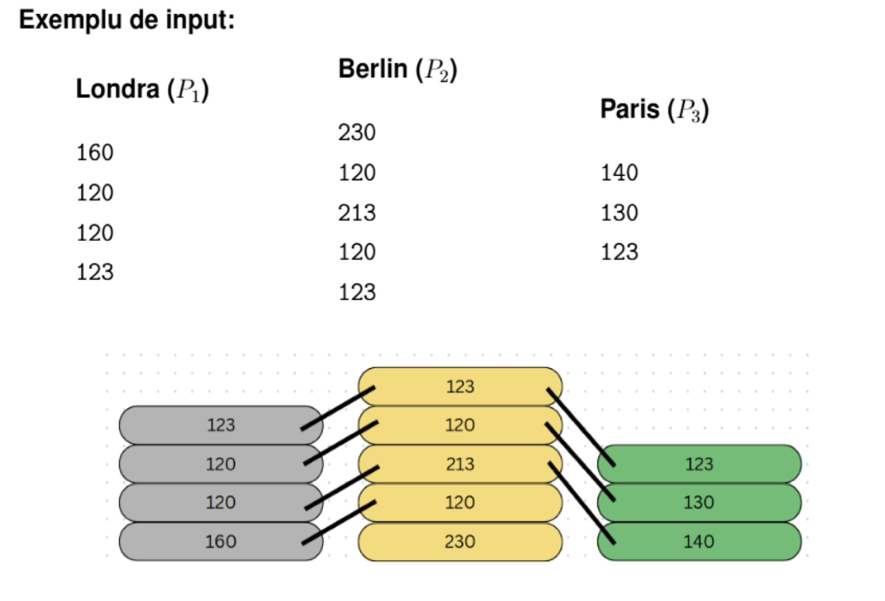

# Manager de portofliu GigiQuant
Descriere
Acest proiect este conceput ca o serie de 4 interviuri tehnice (plus un bonus) pentru o poziție de manager de portofoliu în cadrul companiei „GigiQuant”. Scopul principal este aplicarea cunoștințelor de structuri de date și algoritmi în rezolvarea unor probleme complexe din domeniul financiar.
## Cum se compileaza si ruleaza pe checker:
Proiectul folosește un Makefile pentru automatizarea procesului de compilare.
1. Compilare
```
Bash
make
```
2. Executie
```
Bash
/.checker2 -i
```
## Task1
Scopul acestui prim task este implementarea calculului indicatorului Sharpe Ratio folosind structuri de date de tip listă simplu înlănțuită.
### Functionalitate
- **Citirea datelor** : Citește istoricul prețurilor dintr-un fișier de intrare.
- **Stocare** : Utilizeaza o lista simplu inlantuita pentru a mentine valorile si randamentul calculat
- **Calcul**:
    - Randament
    - Randament mediu
    - Volatilitate
    - Sharpe Ratio
- **Output** : Salvează rezultatele (randament mediu, volatilitate, Sharpe Ratio) într-un fișier de ieșire, trunchiate la 3 zecimale.
### Structura Date:
Structura listei înlănțuite:
```c
struct elem
{
    double valoare;
    double randament;
    struct elem* next;

};
```
### INPUT/OUTPUT
- Input(format)
    - Prima linie:numarul total de observatii(N)
    - Linii urmatoare: valorile preturilor la fiecare moment de timp.
- Output:
    - Linia1:Randament mediu
    - Linia2:Volatilitatea
    - Linia3:Sharpe Ratio
### Parti de cod :
- Pentru calcularea randament mediu:
```c
void randament_mediu(double *rand_mediu, node *caplista, int n)
{
    int i;
    double suma = 0;
    caplista = caplista->next;//primu randament e 0
    for (i = 1; i < n ; i++)
    {
        suma = caplista->randament + suma;//fac suma elementelor
        caplista = caplista->next;
    }
    *rand_mediu = (suma / (n - 1)) ;//nu-l iau pe primu la  calcul ,daia e n-1
}
```
- Pentru Volatilitate :
```c
void volatilitate(double *volat, double rand_mediu, node *caplista, int n)
{
    int i;
    double suma = 0;
    caplista = caplista->next;//primu randament e 0,deci mergem la urm arg
    for (i = 1; i < n ; i++)
    {
        suma += (caplista->randament - rand_mediu) * (caplista->randament - rand_mediu);//fac suma patratelor
        caplista = caplista->next;//trec la urm element
    }
    if (n > 1)
    {
        *volat = sqrt(suma / (n - 1));
    }
    else
    {
        *volat = 0;//daca n e mai mic ca 1 da ori numar complex ori cazu 1/0
    }
}
```
- Pentru calcularea sharp ratio :
```c
void calculare_sharp_ratio(double *sharp_ratio, double rand_mediu, double volat, double rand_frisc)
{
    if (volat != 0)
    {
        *sharp_ratio = (rand_mediu - rand_frisc) / volat;//chiar daca randamentu fara risc e 0 in problema,si in teorie absenta lui nu afecteaza cu nmc in acest caz,am zis sa respect formula,desi variabila o sa ocupa o parte din memorie,nu o sa ocupe foarte mult,si aceia va fi eliberata cand se termina programu
    }
    else
    {
        *sharp_ratio = 0;//daca volat e 0 da cazu 1/0 care tinde spre infint
    }
}
```
- Trunchiere
  ```c
  rand_mediu = ((double)((int)(rand_mediu * 1000))) / 1000;//
    volat = ((double)((int)(volat * 1000))) / 1000;
    sharp_ratio = ((double)((int)(sharp_ratio * 1000))) / 1000;
  ```
## Task2
Acest task simulează identificarea oportunităților de arbitraj pe trei piețe diferite, folosind stive pentru stocarea prețurilor și o coadă pentru stocarea oportunităților identificate.
structuri de date de tip listă simplu înlănțuită.
### Functionalitate
- Stocare prețuri: Utilizarea a trei stive pentru a menține istoricul cronologic al prețurilor pentru fiecare piață (Londra, Berlin, Paris).
- Identificare Arbitraj: Implementarea logicii de comparare a prețurilor:
    - Se identifică zilele în care două prețuri sunt identice și al treilea este diferit.
    - Se calculează diferența absolută dintre prețul pieței „anomale” și cel al piețelor identice.
- Managementul Oportunităților: Stocarea rezultatelor într-o coadă (FIFO) pentru a fi procesate/afișate în ordinea descoperirii.
### Structura Date:
```c
struct vector_stiva
{
    int top;
    int capacitate;
    float *pret;
    char nume_piata[30];//oras
};
typedef struct vector_stiva piata;
struct lista_coada
{
    int zi;
    float dif_piata;
    char nume_piata[30];
    struct lista_coada* next;
};
typedef struct lista_coada nod;
struct Q
{
    nod *fata,*spate;
};
typedef struct Q oportunitati;
```
### INPUT/OUTPUT
- Input(format)
  Fișier text cu numele piețelor urmate de lista de prețuri.
- Output:
  Formatul: ``` ziua <nr> - <diferenta> - <nume_piata> ```

Output:
``` ziua 2 - 10 - Paris ```
### Parti de cod :
-Aflare numar de zile(nr minim elemnte din stiva):
```c
int nr_min_stiva(const piata* s1, const piata* s2, const piata* s3)
{
    //vedem unde ne oprim,caci nu puteam sa folosim preturi inexistente
    int mini = s1->top;
    if (mini > s2->top)
    { 
        mini = s2->top;
    }  
    if (mini > s3->top)
    {
        mini = s3->top;     
    } 
    return mini + 1;
}
```
-Umplerea cozii cu oportunitati:
```c
void oportunitatile_din_piata(piata* s1, piata* s2, piata* s3, oportunitati* c)
{
    int mini = nr_min_stiva(s1, s2, s3);
    int ziua;
    float dif_piata;
    
    for (ziua = 0; ziua < mini; ziua++)
    {
        //o luam invers pt parcurgerea stivei deoarece functioneaza pe principiul first in last out,si ultimul element din ea e prima zi
        int i1 = s1->top - ziua;
        int i2 = s2->top - ziua;
        int i3 = s3->top - ziua;
        //regula:trebuia ca 2 zile sa fie la fel si una diferita si in coada se adauga diferenta dintre o zi la fel si ziuacare nu seamna
        //restu cazurilor nu se iau la calcul
        //ziua+1 ca nu se incepe de la ziua 0
        if (s1->pret[i1] == s2->pret[i2] && s1->pret[i1] != s3->pret[i3])
        {
            dif_piata = s3->pret[i3] - s1->pret[i1];
            if (dif_piata < 0) dif_piata = dif_piata * (-1);//diferenta tre sa fie pozitiva
            adaugare_elemente(c, dif_piata, ziua + 1, s3->nume_piata);
        }
        if (s1->pret[i1] == s3->pret[i3] && s1->pret[i1] != s2->pret[i2])
        {
            dif_piata = s2->pret[i2] - s1->pret[i1];
            if (dif_piata < 0) dif_piata = dif_piata * (-1);
            adaugare_elemente(c, dif_piata, ziua + 1, s2->nume_piata);
        }
        if (s3->pret[i3] == s2->pret[i2] && s3->pret[i3] != s1->pret[i1])
        {
            dif_piata = s1->pret[i1] - s3->pret[i3];
            if (dif_piata < 0) dif_piata = dif_piata * (-1);
            adaugare_elemente(c, dif_piata, ziua + 1, s1->nume_piata);
        }
    }
}
```


