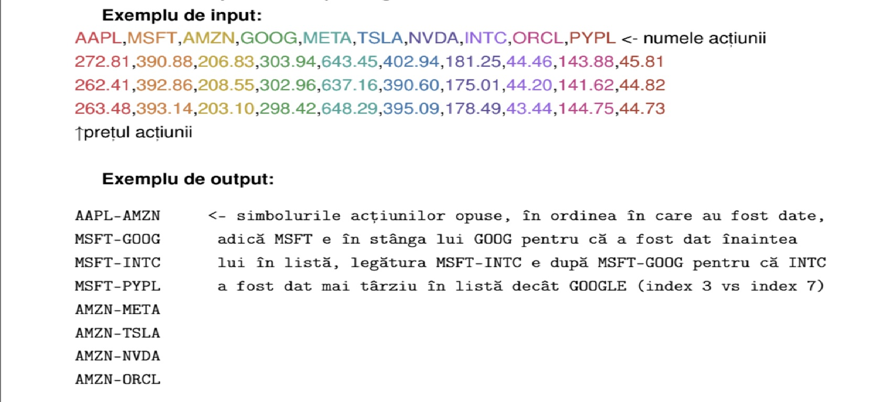
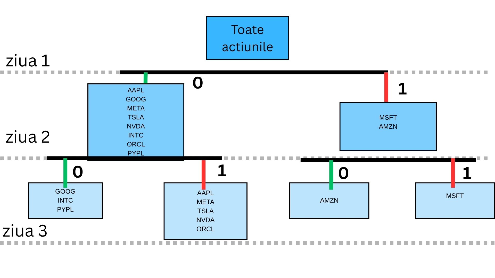
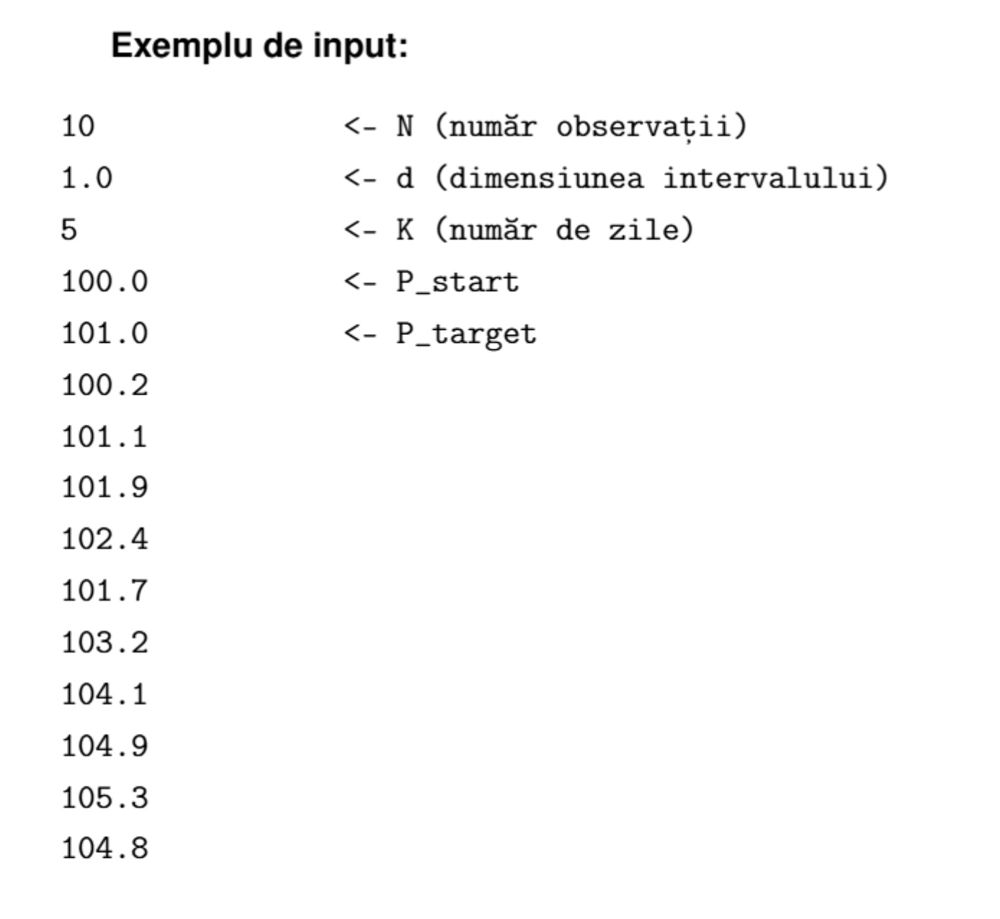
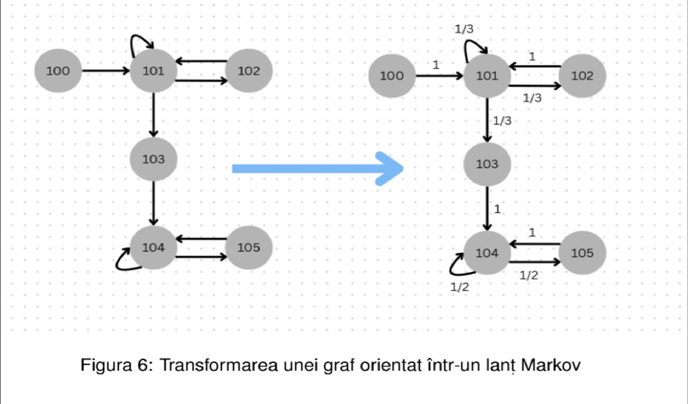
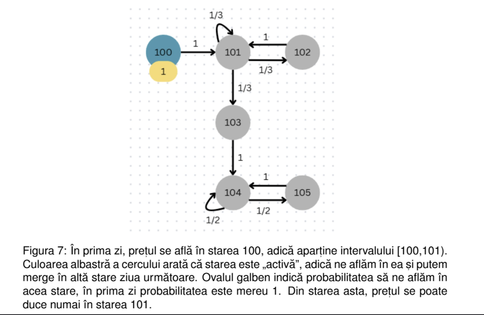
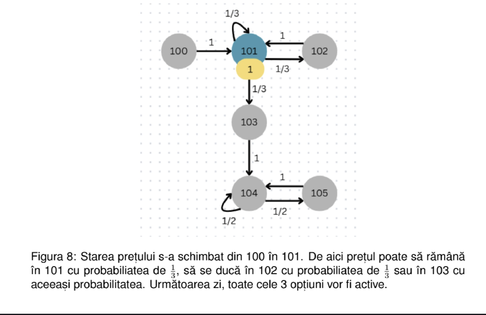
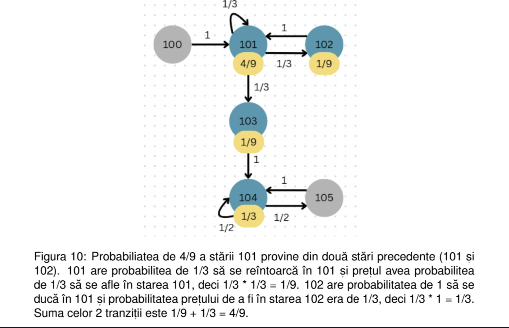
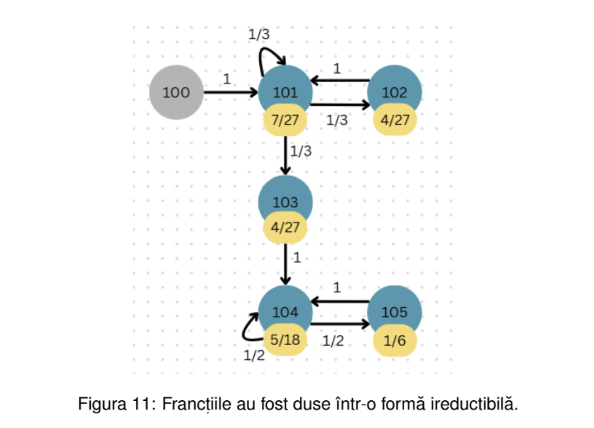

# Manager de portofliu GigiQuant
Descriere
Acest proiect este conceput ca o serie de 4 interviuri tehnice (plus un bonus) pentru o poziție de manager de portofoliu în cadrul companiei „GigiQuant”. Scopul principal este aplicarea cunoștințelor de structuri de date și algoritmi în rezolvarea unor probleme complexe din domeniul financiar.
## Cum se compileaza si ruleaza pe checker:
Proiectul folosește un Makefile pentru automatizarea procesului de compilare.
1. Compilare 
```
make
```
2. Executie task bonus
```
   ./test bonus
```
3. Executie
```
/.checker2 -i
```
## Memorie
Pentru fiecare structura de date alocata dinamica s a facut o functie de eliberare a memorie,pt evitare memory leak
## Task1
Scopul acestui prim task este implementarea calculului indicatorului Sharpe Ratio folosind structuri de date de tip listă simplu înlănțuită.
### Functionalitate
- **Citirea datelor** : Citește istoricul prețurilor dintr-un fișier de intrare.
- **Stocare** : Utilizeaza o lista simplu inlantuita pentru a mentine valorile si randamentul calculat
- **Calcul**:
    - Randament
    - Randament mediu
    - Volatilitate
    - Sharpe Ratio
- **Output** : Salvează rezultatele (randament mediu, volatilitate, Sharpe Ratio) într-un fișier de ieșire, trunchiate la 3 zecimale.
### Structura Date:
Structura listei înlănțuite:
```c
struct elem
{
    double valoare;
    double randament;
    struct elem* next;

};
```
### INPUT/OUTPUT
- Input(format)
    - Prima linie:numarul total de observatii(N)
    - Linii urmatoare: valorile preturilor la fiecare moment de timp.
- Output:
    - Linia1:Randament mediu
    - Linia2:Volatilitatea
    - Linia3:Sharpe Ratio
### Parti de cod :
- Pentru calcularea randament mediu:
```c
void randament_mediu(double *rand_mediu, node *caplista, int n)
{
    int i;
    double suma = 0;
    caplista = caplista->next;//primu randament e 0
    for (i = 1; i < n ; i++)
    {
        suma = caplista->randament + suma;//fac suma elementelor
        caplista = caplista->next;
    }
    *rand_mediu = (suma / (n - 1)) ;//nu-l iau pe primu la  calcul ,daia e n-1
}
```
- Pentru Volatilitate :
```c
void volatilitate(double *volat, double rand_mediu, node *caplista, int n)
{
    int i;
    double suma = 0;
    caplista = caplista->next;//primu randament e 0,deci mergem la urm arg
    for (i = 1; i < n ; i++)
    {
        suma += (caplista->randament - rand_mediu) * (caplista->randament - rand_mediu);//fac suma patratelor
        caplista = caplista->next;//trec la urm element
    }
    if (n > 1)
    {
        *volat = sqrt(suma / (n - 1));
    }
    else
    {
        *volat = 0;//daca n e mai mic ca 1 da ori numar complex ori cazu 1/0
    }
}
```
- Pentru calcularea sharp ratio :
```c
void calculare_sharp_ratio(double *sharp_ratio, double rand_mediu, double volat, double rand_frisc)
{
    if (volat != 0)
    {
        *sharp_ratio = (rand_mediu - rand_frisc) / volat;//chiar daca randamentu fara risc e 0 in problema,si in teorie absenta lui nu afecteaza cu nmc in acest caz,am zis sa respect formula,desi variabila o sa ocupa o parte din memorie,nu o sa ocupe foarte mult,si aceia va fi eliberata cand se termina programu
    }
    else
    {
        *sharp_ratio = 0;//daca volat e 0 da cazu 1/0 care tinde spre infint
    }
}
```
- Trunchiere
  ```c
  rand_mediu = ((double)((int)(rand_mediu * 1000))) / 1000;//
    volat = ((double)((int)(volat * 1000))) / 1000;
    sharp_ratio = ((double)((int)(sharp_ratio * 1000))) / 1000;
  ```
## Task2
Acest task simulează identificarea oportunităților de arbitraj pe trei piețe diferite, folosind stive pentru stocarea prețurilor și o coadă pentru stocarea oportunităților identificate.
structuri de date de tip listă simplu înlănțuită.
### Functionalitate
- Stocare prețuri: Utilizarea a trei stive pentru a menține istoricul cronologic al prețurilor pentru fiecare piață (Londra, Berlin, Paris).
- Identificare Arbitraj: Implementarea logicii de comparare a prețurilor:
    - Se identifică zilele în care două prețuri sunt identice și al treilea este diferit.
    - Se calculează diferența absolută dintre prețul pieței „anomale” și cel al piețelor identice.
- Managementul Oportunităților: Stocarea rezultatelor într-o coadă (FIFO) pentru a fi procesate/afișate în ordinea descoperirii.
### Structura Date:
```c
struct vector_stiva
{
    int top;
    int capacitate;
    float *pret;
    char nume_piata[30];//oras
};
typedef struct vector_stiva piata;
struct lista_coada
{
    int zi;
    float dif_piata;
    char nume_piata[30];
    struct lista_coada* next;
};
typedef struct lista_coada nod;
struct Q
{
    nod *fata,*spate;
};
typedef struct Q oportunitati;
```
### INPUT/OUTPUT
- Input(format)
  Fișier text cu numele piețelor urmate de lista de prețuri.
- Output:
  Formatul: ``` ziua <nr> - <diferenta> - <nume_piata> ```

Output:
``` ziua 2 - 10 - Paris ```
### Parti de cod :
-Aflare numar de zile(nr minim elemnte din stiva):
```c
int nr_min_stiva(const piata* s1, const piata* s2, const piata* s3)
{
    //vedem unde ne oprim,caci nu puteam sa folosim preturi inexistente
    int mini = s1->top;
    if (mini > s2->top)
    { 
        mini = s2->top;
    }  
    if (mini > s3->top)
    {
        mini = s3->top;     
    } 
    return mini + 1;
}
```
-Umplerea cozii cu oportunitati:
```c
void oportunitatile_din_piata(piata* s1, piata* s2, piata* s3, oportunitati* c)
{
    int mini = nr_min_stiva(s1, s2, s3);
    int ziua;
    float dif_piata;
    
    for (ziua = 0; ziua < mini; ziua++)
    {
        //o luam invers pt parcurgerea stivei deoarece functioneaza pe principiul first in last out,si ultimul element din ea e prima zi
        int i1 = s1->top - ziua;
        int i2 = s2->top - ziua;
        int i3 = s3->top - ziua;
        //regula:trebuia ca 2 zile sa fie la fel si una diferita si in coada se adauga diferenta dintre o zi la fel si ziuacare nu seamna
        //restu cazurilor nu se iau la calcul
        //ziua+1 ca nu se incepe de la ziua 0
        if (s1->pret[i1] == s2->pret[i2] && s1->pret[i1] != s3->pret[i3])
        {
            dif_piata = s3->pret[i3] - s1->pret[i1];
            if (dif_piata < 0) dif_piata = dif_piata * (-1);//diferenta tre sa fie pozitiva
            adaugare_elemente(c, dif_piata, ziua + 1, s3->nume_piata);
        }
        if (s1->pret[i1] == s3->pret[i3] && s1->pret[i1] != s2->pret[i2])
        {
            dif_piata = s2->pret[i2] - s1->pret[i1];
            if (dif_piata < 0) dif_piata = dif_piata * (-1);
            adaugare_elemente(c, dif_piata, ziua + 1, s2->nume_piata);
        }
        if (s3->pret[i3] == s2->pret[i2] && s3->pret[i3] != s1->pret[i1])
        {
            dif_piata = s1->pret[i1] - s3->pret[i3];
            if (dif_piata < 0) dif_piata = dif_piata * (-1);
            adaugare_elemente(c, dif_piata, ziua + 1, s1->nume_piata);
        }
    }
}
```

## Task3
Acest task urmărește optimizarea unui portofoliu prin identificarea acțiunilor care se mișcă în direcții opuse (acțiuni „oglindite”), folosind arbori binari pentru a modela evoluția prețurilor.
### Functionalitate
- Modelare prin Arbori Binari: Fiecare nod al arborelui reprezintă un moment în timp, unde ramura stângă (0) indică o scădere a prețului, iar ramura dreaptă (1) indică o creștere.
- Analiza Oglindirii: Identificarea perechilor de acțiuni care prezintă mișcări opuse pe întreaga perioadă de timp (dacă una scade, cealaltă crește).
- Gestionare date: Citirea prețurilor din fișier și stocarea lor într-o structură de tip listă înlănțuită atașată nodurilor arborelui.
### Structura Date:
```c
typedef struct actiune
{
    char nume[4];
    float *pret;
    struct actiune *next;
}actiune;
typedef struct arbore
{
    actiune *act;
    struct arbore *left;
    struct arbore *right;
    int h;
}arbore;
```
### INPUT/OUTPUT
- Input(format)
  Datele sunt primite sub formă de tabel (matrice), unde prima linie conține simbolurile acțiunilor, iar liniile următoare conțin prețurile acestora pentru fiecare zi.<br>
    - Prima linie: Lista simbolurilor acțiunilor (numele companiilor).
    - Liniile următoare: Prețurile acțiunilor în ordine cronologică (fiecare linie reprezintă o zi).
- Output:
    Programul trebuie să identifice perechile de acțiuni „oglindite” (care evoluează în direcții opuse: când una crește, cealaltă scade) și să le afișeze sub forma ``` ACȚIUNE1-ACȚIUNE2. ```<br>
  Exemplu :
  -fisierele de intrare/iesire
  
  -arbore :
  
### Parti de cod :
- adauagare in actiuni:
    - nume companie
    ```c
    const char *denumire;
    denumire = strtok(nume," ,\r\n");
    int nr_act = 0;
    //cand citim prima linie o vedem ca pe un sir lung de carcatere ce trb despartit in cuv
    while (denumire != NULL && nr_act < 10)
    {
        aux[nr_act++] = nou_nod(denumire);//umplem prima linie,teoretic nu mi trb nr_act sa     l numar,pt ca stiu ca i 10,l am pus sa verific daca vede bn cuv
        denumire = strtok(NULL," ,\r\n");
    }
    ```
    - preturi:
    ```c
         nr_tzile = nr_tzile-1;
    float val;
    //fisierul nostru putem sa l asemnam cu o matrice  cu 10 coloane,caci sunt 10 companii si cu nr_zile linii
     for(int zi = 1 ; zi <= nr_tzile ;zi++)//zi=0,prima line,deja citita
     {
            {
                for(int j = 0 ; j < 10 ; j++)
                
                {
                   if(fscanf(fi,"%f,",&val) == 1) aux[j]->pret[zi] = val;
                }
            }
     }
    ```
- populare arbore si constructia vectorului de drumuri:
    ```c
        for(int j = 0 ; j<nr_act ; j++)
    {
        drum[j] = (char*)malloc((nr_tzile+1)*sizeof(char));
        drum[j][0] = '\0';
        arbore *curent = root;
        adauga_in_arbore(curent,aux[j]->nume);//ziua 1,compania e mom in root
        for(int zi = 2; zi <= nr_tzile ; zi++)
         {
             if (aux[j]->pret[zi] < aux[j]->pret[zi-1]) 
             {
                  if (curent->left == NULL)
                   {
                     curent->left = nod_arbore(zi);//ziua reprez cat de adanc e nodul
                     //daca o ia la stanga vectorului de drum i se adauga val aceasta
                    }
                strcat(drum[j],"0");
                 curent = curent->left;//trecem la stanga
            }
        
             else
            {
                 if(curent->right == NULL)
                 {
                    curent->right = nod_arbore(zi);
                    //daca o ia la dreapta vectorului de drum i se adauga val aceasta
                }
                strcat(drum[j],"1");
                 curent = curent->right;//trecem la dreapta
             }
        adauga_in_arbore(curent,aux[j]->nume);//dupa ce "ne am plimbat" cu nodu arbore pana am ajuns la capat,punem compania
        }
  }
    ```
- Verificare oglindit
  ```c
      for(int j1 = 0 ; j1 < nr_act-1 ; j1 ++)
    {
        for(int j2 = j1+1 ; j2 < nr_act ; j2 ++)
        {
            ok=1;
            for (int carcacter=0 ;drum[j1][carcacter] != '\0' && drum[j2][carcacter]; carcacter++ )
            {
                if(drum[j1][carcacter] == drum[j2][carcacter])
                {
                    ok = 0;
                    break;
                }
            }
       }
  }
  ```
### Observatie && Loc de imbunatatirir
In cod se gaseste o metoda doar cu parcurgerea arboreului,luand doar frunzele,dar care nu da pentru data 14
## Task4
Acest task modelează evoluția prețurilor acțiunilor folosind Lanțuri Markov. Prețurile sunt grupate în intervale (stări), iar probabilitățile de tranziție între aceste stări sunt calculate empiric din datele istorice.
### Functionalitate
- Discretizarea prețurilor: Împărțirea axei prețurilor în intervale de dimensiune $\Delta$, unde fiecare interval devine o stare în lanțul Markov.
- Construcția Grafului: Crearea unui graf orientat în care nodurile sunt intervalele de preț, iar muchiile poartă probabilitatea de tranziție de la un interval la altul.
- Simularea Probabilităților: Calculul iterativ al probabilității de a ajunge într-un interval țintă ($P_{target}$) după $K$ zile, pornind de la un preț inițial ($P_{start}$).
- Precizie matematică: Rezultatele sunt exprimate sub formă de fracții ireductibile, folosind cel mai mare divizor comun (CMMDC) pentru simplificare.
### Structura Date:
```c
tstruct elem_graf
{
    int destinatie;
    int numarator;
    int numitor;
    struct elem_graf* next;
} ;
typedef struct elem_graf nod_graf;
typedef struct 
{
int V; // nr. varfuri
int E; // nr. muchii
nod_graf** matrice;
} Graph ;
```
### INPUT/OUTPUT
- Input(format)
    - N: Numărul de observații (prețuri istorice).
    - d: Dimensiunea intervalului pentru stări.
    - K: Numărul de zile pentru care calculăm probabilitatea.
    - $P_{start}$: Prețul inițial.
    - $P_{target}$: Prețul țintă pentru care calculăm probabilitatea de atingere.
    - Seria de prețuri: Valorile istorice ($P_1, \dots, P_N$).
- Output:
    Programul generează, pentru fiecare zi de la $1$ la $K$, probabilitatea ca prețul să se afle în intervalul corespunzător lui $P_{target}$. Rezultatul este afișat sub formă de fracție ireductibilă.<br>
  Exemplu :
  - fisierele de intrare
  
  - graf :
  
  - zile :
      - ziua 1 : 
      - ziua 2 : 
      - ziua 3 : 
      - ziua 4 : 
      - ziua 5 : 
### Parti de cod :
-calcularea capete :
- pret_minim :
    ```c
       void aflare_minim(float *minim,const float preturi[], int N)//aflam minimul pt afla nr         de noduri si pozitiilor din graf numerelor din interval
   {
    *minim = preturi[0];
    for(int i = 1; i < N; i++)
    {
        if(*minim > preturi[i]) *minim = preturi[i];
    }
   }
     ```  
   - pret maxim
   ```c
      void aflare_max(float *maxim,const float preturi[], int N)//aflam maximul pt afla nr de noduri
   {
    *maxim = preturi[0];
    for(int i = 1; i < N; i++)
    {
        if(*maxim < preturi[i]) *maxim = preturi[i];
    }
   }
   ``` 
- adauagare in graf:
    - muchii
    ```c
     for(int i = 0 ; i < N-1 ; i++)
    {
        int poz1 = (int)((preturi[i] - pret_minim) / d);
        int poz2 = (int)((preturi[i+1] - pret_minim) / d);
        nod_graf *aux = g->matrice[poz1];
        int gasit = 0;
        //Verificam daca muchia deja exista
        while(aux != NULL)
        {
            if(aux->destinatie == poz2)
            {
                aux->numarator++;
                gasit=1;
                break;
            }
            aux=aux->next;
        }
        //daca nu exista 
        if( gasit == 0)
        {
            nod_graf* nod_nou=(nod_graf*)malloc(sizeof(nod_graf));
            nod_nou->destinatie = poz2;
            nod_nou->numarator = 1;
            nod_nou->numitor = 1;
            nod_nou->next = g->matrice[poz1];
            g->matrice[poz1] = nod_nou;
        }
    }
    ```
    - numitori:
    ```c
        for(int i = 0 ; i < g->V  ; i++)
    {
        int nr_muchii = 0;
        nod_graf *aux = g->matrice[i];
        while(aux != NULL)
        {
            nr_muchii += aux->numarator; 
            aux=aux->next;
        }
        aux = g->matrice[i];
        while(aux != NULL)
        {
             if(nr_muchii == 0)
            {
               aux->numitor= 1;
            }
           else aux->numitor = nr_muchii;//numitor=numara cazuri posibile=toate muchiile
            aux=aux->next;
        }

    }
    ```
- calcularea probabilitatilor:
    - ziua 1:
    ```c
        if(pozitie_start >= 0 && pozitie_start < g->V) {
        numarator_curent[pozitie_start] = 1;
        numitor_curent[pozitie_start] = 1;
    }
    ```
    - restul
  ```c
     for(int zi_curent = 0; zi_curent < zile; zi_curent++)
    { //afisare numitor si numarator de p target
        for(int i = 0; i < g->V; i++)
        {
            if (numarator_curent[i] != 0) //daca numitoru e 0 nu mai merge
            {
                nod_graf* vecin = g->matrice[i];
                while( vecin != NULL)
                {
                    int j = vecin->destinatie;
                        long long suma_numarator = numarator_urmator[j] * (numitor_curent[i] * vecin->numitor) + (numarator_curent[i] * vecin->numarator)* numitor_urmator[j];//suma numaratorilor,am adus direct la acelas numitor
                        long long numitor_probab = numitor_urmator[j] * (numitor_curent[i] * vecin->numitor);//aducem la acelas numitor
                        long long simplificare = cmmdc(suma_numarator, numitor_probab);//pt aduce la o forma ireductibila
                        numarator_urmator[j] = suma_numarator / simplificare;
                        numitor_urmator[j] = numitor_probab / simplificare;
                    vecin=vecin->next;
                }
            }
        }
        //trecem la urmatoarea zi
        for(int i = 0; i < g->V; i++) 
        {
            numarator_curent[i] = numarator_urmator[i];
            numitor_curent[i] = numitor_urmator[i];
        }
  }
  ```
### Observatie && Loc de imbunatatiri
- In cod se gaseste o garficul si cu matrice de adiacenta
- Cred ca se putea face cu stive in loc de 4 vectori la calcularaea probabilitati
- Poate era mai bine cu un char decat cu 2 matrici de numitor,respectiv numarator
- Pentru a evita erorile de precizie ale tipului float în operații repetate, am utilizat long long pentru numărător și numitor.
- Probabilitatea nu este calculată prin ridicarea matricei la putere, ci prin simularea parcurgerii grafului zi cu zi, ceea ce asigură o precizie mai bună în contexte de date reale.
## Task bonus
Pentru cerința bonus, am extins funcționalitatea programului aducându-l în lumea reală. Am trecut de la citirea prețurilor din fișiere text statice la preluarea dinamică a datelor financiare direct de pe internet.
In programul meu ia pt compania "GOOGL" preturile si imi afiseaza pretul maxim si minim

  


